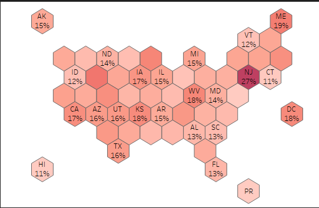

## Data Scientist

### Skills
- Programming: *Python (pandas, numpy, scikit-learn, matplotlib, seaborn), R (tidyverse, tidymodels, ggplot), SAS, SQL*
- Tools: *Tableau, Microsoft Office, SAS Viya*

### Education
- M.S. Applied Analytics @ Columbia University, New York (_Dec 2025_)
- B.E. Electrical @ Birla Institute of Tech. & Science, Pilani (_May 2021_)

### Experience

Fraud Analytics @ JPMorgan Chase (_Sep 2022 - Jun 2024_)
- Developed predicted models and business strategies to mitigate fraud on Chase credit cards. 
- Created reports to track losses and identify emerging fraud trends.

Consumer Data Science @ JPMorgan Chase (_Jun 2021 - Aug 2022_)
- Developed models and features to increase credit application approval rates in the new-to-credit customer segment.

### Projects
#### [Project 1: Visualizing Flight Punctuality](https://ashishmathew98.github.io/AirlineDelays/)
**Objective:** Identify carriers and regions with poor service and drivers behind delays.

