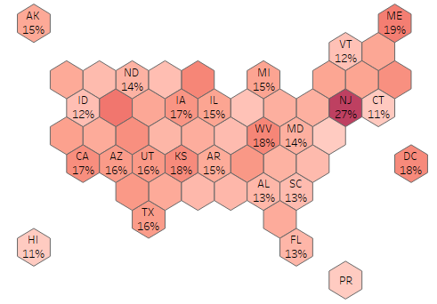

## Data Scientist
### Skills
- Programming: *Python, R, SAS, SQL*
- Tools: *Tableau, Microsoft Office, SAS Viya*
### Education
- M.S. Applied Analytics @ Columbia University, New York (_Dec 2025_)
- B.E. Electrical @ Birla Institute of Tech. & Science, Pilani (_May 2021_)
### Experience
Fraud Analytics @ JPMorgan Chase (_Sep 2022 - Jun 2024_)
- Developed predictive models and business strategies to mitigate fraud on Chase credit cards. 
- Created reports tracking losses and identifying emerging fraud trends.

Consumer Data Science @ JPMorgan Chase (_Jun 2021 - Aug 2022_)
- Developed models and features to increase credit application approval rates in the new-to-credit customer segment.
### Projects
#### [Analyzing Airline Delays](https://ashishmathew98.github.io/AirlineDelays/)
**Objective:** Identify carriers and regions with poor service and drivers behind delays.

#### [Predict Advertisement Click-Through Rate](https://ashishmathew98.github.io/PredictingClicks/)
**Objective:** Build machine-learning models to predict the click-through rate of an advertisment.

